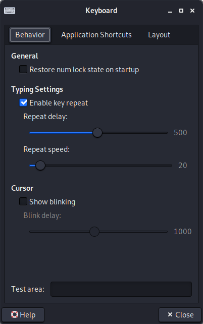
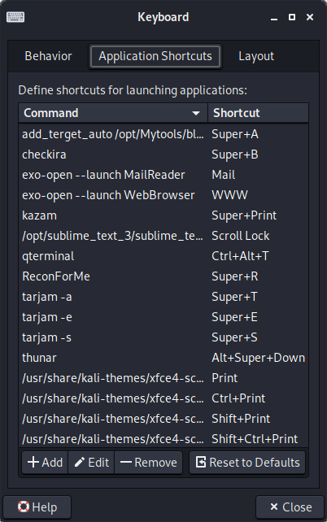
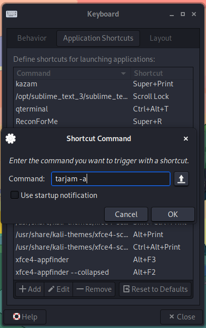
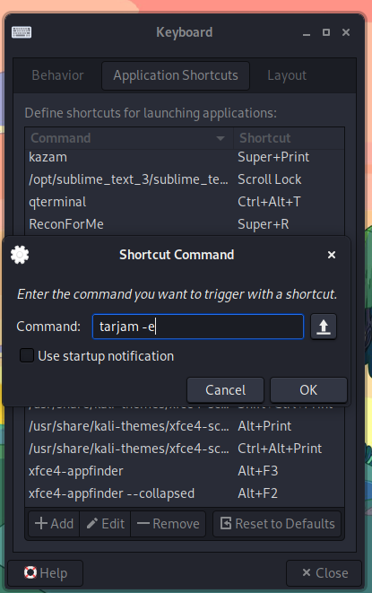
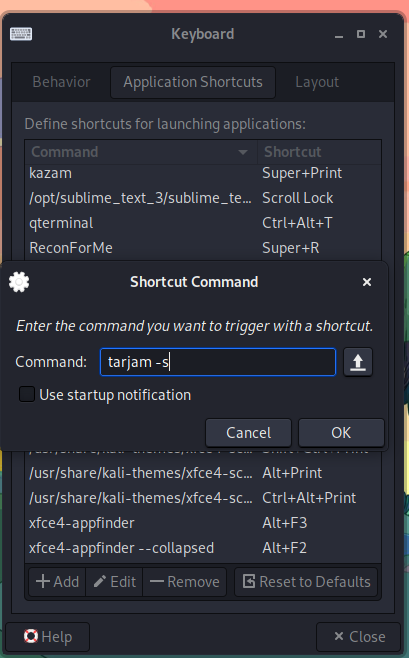
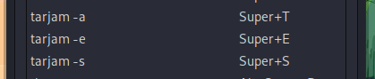

 # Tarjam 

A Free tool to translate from english into arabic or from any language to english using the hover 
Tarjam uses [trans](https://github.com/soimort/translate-shell) tool for translation and xclip for geting the text from hover . 

## INSTALLATION GUIDE: 

* sudo make  
* make shortcut key to Tarjam command : 
  1. #### go to settings>keyboard>Application Shortcut :
     &nbsp;&nbsp;&nbsp;&nbsp; 
  3. #### press add then `tarjam -a` as command then choose your shortcut for translat to arabic :
      
  3. #### press add then `tarjam -e` as command then choose your shortcut for translat to english :
      
  5. #### press add then `tarjam -s` as command then choose your shortcut for speech the word :
      
  6. #### final result :
      
 ### Note: this work on `xfce` you need to search on others 
### what need this tools : 

* [ Trans ](https://github.com/soimort/translate-shell)
* [ notify-send ](http://manpages.ubuntu.com/manpages/xenial/man1/notify-send.1.html)
* [ xclip ](https://github.com/astrand/xclip) 

### better environment : 

* xfce linux distribution  
